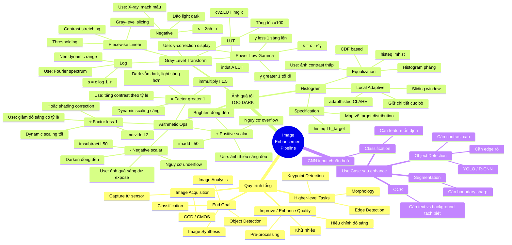

# IVP — Mindmap mở rộng từ note thô

**Nguồn gốc:** `D:\MSA-FPT\Image and video processing\note_mindmap.md`
**Trạng thái:** ⬜ Chưa chưng cất
**Chủ đề cha:** [[SECOND_BRAIN_IVP]]
**Dự kiến tách:** đã cấu trúc sẵn → tách atomic note dễ nhất, LÀM TRƯỚC

> ⚠️ **Note thô** — nguyên trạng từ nguồn gốc, chưa chia thành khái niệm nguyên tử.
> Nằm trong `_inbox/` nên app không đọc, không lên graph.

---
# MINDMAP — Các Case xử lý ảnh trong note.md

> Tổng hợp & mở rộng từ `note.md` — sắp xếp lại theo **vấn đề → giải pháp → use case → công thức + code**.

---

## 1. SƠ ĐỒ MINDMAP (Mermaid)



---

## 2. CHI TIẾT TỪNG CASE

### Case nền — Pipeline tổng quan

```
Image Acquisition → Enhance Quality → Higher-level Processing → Analysis/Synthesis
     (sensor)        (point ops,        (morphology,              (object detection,
                      filter, hist)      edge, keypoint)           classification)
```

**Ý chính**: Enhance là **bước tiền xử lý bắt buộc** trước khi đưa vào các bước phân tích cao cấp. Ảnh càng "sạch" thì các bước sau càng chính xác.

---

### Case chính — Ảnh quá tối (Too Dark)

Có **3 nhóm giải pháp**, dùng tuỳ tình huống:

#### NHÓM A: Arithmetic Operations (Lecture 5)

| Phép | Công thức | Khi nào dùng | Code OpenCV/Python |
|---|---|---|---|
| **+ positive scalar** | `s = r + k` | Ảnh thiếu sáng **đều khắp** | `cv2.add(img, 50)` |
| **− negative scalar** | `s = r − k` | Ảnh dư sáng đều | `cv2.subtract(img, 50)` |
| **× factor > 1** | `s = r × k` (k>1) | Muốn **giãn contrast** theo tỉ lệ | `cv2.multiply(img, 1.5)` |
| **÷ factor < 1** | `s = r / k` (k>1) | Muốn nén dải hoặc shading correction | `cv2.divide(img, 2)` |

**Khác biệt quan trọng** (theo L5 §5.1.3):
- `+ scalar` (additive offset): nâng **đều** mọi pixel → mất chi tiết ở vùng sáng do **clipping** (saturate 255)
- `× factor` (dynamic scaling): nhân theo tỉ lệ → vùng tối vẫn tối, vùng sáng càng sáng → **giữ chi tiết tốt hơn**

→ **Quy tắc**: nếu chỉ "thiếu sáng" thì dùng `+`; nếu "thiếu contrast" thì dùng `×`.

#### NHÓM B: Gray-Level Transformation (Lecture 6)

Hàm `s = T(r)` thông minh hơn vì biến đổi **phi tuyến**, phù hợp với cách mắt người cảm nhận độ sáng.

| Phép | Công thức | Đặc trưng | Use case |
|---|---|---|---|
| **Negative** | `s = 255 − r` | Đảo light-dark | X-ray, mạch máu, ảnh blueprint |
| **Log** | `s = c · log(1+r)` | Nén dải sáng, giãn dải tối | Hiển thị Fourier spectrum |
| **Inverse log** | `s = exp(r/c) − 1` | Nén dải tối, giãn dải sáng | Khôi phục sau log |
| **Power-Law (γ<1)** | `s = c · r^γ` | Làm **sáng** ảnh tối, mở rộng dải tối | γ-correction LCD, ảnh underexposed |
| **Power-Law (γ>1)** | `s = c · r^γ` | Làm **tối** ảnh sáng | Ảnh overexposed |
| **Piecewise linear** | Linh hoạt từng đoạn | Tự định nghĩa từng vùng | Slicing, thresholding |

**Tăng tốc**: dùng **LUT** (`cv2.LUT`, `intlut`) — tính trước 256 giá trị, tra bảng cực nhanh.

#### NHÓM C: Histogram Processing (Lecture 6)

Khi `+` và `T(r)` không giải quyết được (ảnh contrast thấp, histogram dồn cục), dùng histogram:

| Kỹ thuật | Cách hoạt động | Khi nào dùng |
|---|---|---|
| **Histogram Equalization** | Dùng CDF để trải đều histogram | Ảnh **contrast thấp**, dải động hẹp |
| **Histogram Specification** | Map histogram về **target** mong muốn | Cần ảnh có distribution cụ thể |
| **Local (CLAHE)** | Equalization theo **vùng nhỏ** sliding | Vùng sáng/tối **không đều** trong ảnh |

```python
# Global equalization
eq = cv2.equalizeHist(img_gray)

# Local adaptive (CLAHE)
clahe = cv2.createCLAHE(clipLimit=2.0, tileGridSize=(8,8))
eq_local = clahe.apply(img_gray)
```

---

### Use case downstream (Object Detection / Classification)

Lý do **PHẢI enhance trước** khi chạy các thuật toán này:

| Tác vụ | Vì sao cần enhance |
|---|---|
| **Object Detection** (YOLO, R-CNN) | Edge cần rõ, contrast cao → model detect chính xác hơn |
| **Classification** (CNN) | Feature ổn định, không bị shading sai lệch |
| **Segmentation** (watershed, U-Net) | Boundary giữa object & background phải sharp |
| **OCR** (text recognition) | Text phải tách biệt rõ với background |
| **Morphology** (erosion, dilation) | Thường yêu cầu ảnh binary → cần threshold tốt → cần contrast tốt |
| **Edge Detection** (Sobel, Canny) | Gradient phụ thuộc độ chênh sáng → enhance giúp gradient rõ |
| **Keypoint Detection** (SIFT, ORB) | Keypoint detect dựa trên intensity variation → cần đủ contrast |

---

## 3. CÂY QUYẾT ĐỊNH — Chọn phương pháp nào cho ảnh tối?

```
Ảnh quá tối?
│
├─ Tối ĐỀU toàn bộ ảnh
│   ├─ Cần đơn giản, nhanh? → + scalar (cv2.add)
│   ├─ Muốn giữ chi tiết vùng sáng? → × factor (cv2.multiply)
│   └─ Cần tinh chỉnh theo perception? → Gamma γ<1 (cv2.LUT)
│
├─ Tối KHÔNG ĐỀU (chỗ tối, chỗ sáng)
│   ├─ Có "background gradient"? → imdivide (shading correction)
│   └─ Cần làm rõ chi tiết cục bộ? → CLAHE (cv2.createCLAHE)
│
├─ Contrast THẤP (xám lè không có đen/trắng)
│   ├─ Global → histeq (cv2.equalizeHist)
│   └─ Local → adapthisteq / CLAHE
│
└─ Cần đảo light-dark (chi tiết ẩn ở vùng tối)
    └─ Negative (cv2.bitwise_not hoặc cv2.LUT)
```

---

## 4. BẢNG TỔNG HỢP — Ai làm gì?

| Phương pháp | Lecture | Hàm Python | Hàm MATLAB | Độ phức tạp |
|---|---|---|---|---|
| Add scalar | L5 | `cv2.add` | `imadd` | O(1)/pixel |
| Subtract scalar | L5 | `cv2.subtract` | `imsubtract` | O(1)/pixel |
| Multiply factor | L5 | `cv2.multiply` | `immultiply` | O(1)/pixel |
| Divide factor | L5 | `cv2.divide` | `imdivide` | O(1)/pixel |
| Negative | L6 | `cv2.bitwise_not` / `cv2.LUT` | `imcomplement` | O(1)/pixel (LUT) |
| Log / Gamma | L6 | `cv2.LUT(img, tf)` | `imadjust(...,γ)` | O(1)/pixel (LUT) |
| Histogram equalization | L6 | `cv2.equalizeHist` | `histeq` | O(N) |
| CLAHE | L6 | `cv2.createCLAHE` | `adapthisteq` | O(N×k²) |

---

## 5. GHI CHÚ TỪ NOTE.MD (đã chuẩn hoá)

| Bạn viết | Đúng là | Giải thích |
|---|---|---|
| Image Acuisition | Image **Acquisition** | Khâu thu nhận ảnh từ sensor (L4) |
| Reypoint | **Keypoint** Detection | SIFT, ORB, Harris corner |
| equalifation | **Equalization** | Histogram trải đều (L6 §6.9) |
| tranformation | **Transformation** | Phép biến đổi `s = T(r)` (L6 §6.2) |

→ Note này tổng kết **đúng tinh thần Lecture 5 + 6**: từ phép số học đơn giản → biến đổi gray-level → histogram, tất cả đều phục vụ cho mục tiêu cuối là object detection / classification.

---

*File này tạo từ `note.md` + nội dung Lecture 5 & 6 — dùng để xem khi cần chọn phương pháp xử lý ảnh tối.*
